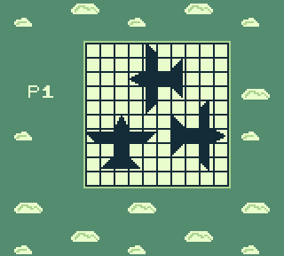
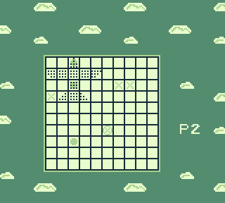
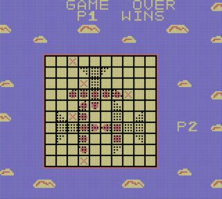

# AIRPLANZ

2 players - 1 Gameboy ROM written in Assembly

## The idea

After I got a taste of [how Nintendo DS programming feels like](https://github.com/NotImplementedLife/FSPDS "one silly project"), I realised that I was stubbornly avoiding the entire magic-driven world of retro graphics or, more exactly, the tiles-sprites ecosystem. The NDS's variety of background and video modes is a discouragingly hostile place for a newcomer like me who thought that displays do nothing but `getPixel()`/`setPixel()` routines. So (during one of my [shower thoughts](https://www.reddit.com/r/Showerthoughts/ "just a meaningless link")) it popped into my mind: _Hmm... Why don't I turn my attention to an older architecture in order to figure out how things actually work?_. And Gameboy was such an appealing target.

Several weeks passed since then without having researched anything, not to mention writing even a single line of code. Why? 'Cause I lacked motivation. Till one day when my annoyed subconscious suddenly roared: _'Too easy for you, boy??? Alright then... Just write it in ASSEMBLY!'_. _'Say no more - Challenge accepted!'_, I replied to myself.

The last thing to decide on was... what game should I write? I've always dreamed about makng my own _Pokémon-like scroll RPG game_, but I wanted something faster to make. Many of the popular arcade-type games like Snake, TicTacToe, 2048 and even CHIP-8 already have Gameboy adaptations (or "ports", to sound more technical). Then I found the 'spark': it was with me everytime, everywhere. And I loved it. It's the game that, just like the guy in [this post](https://boardgamegeek.com/thread/946676/avioane-airplanes-game-battleship "Airplanes game battleship") states, _"In Romania [...] is very popular among students and it is played with pen and paper during recess and during class"_ - and I merely confirm that. So let's do an _Airplanes_ game for Gameboy. Wait a second... _A, I, R, ..._ (grown-up N•I•L uses his fingers to count all the nine letters). Oh, that's odd. Let's make it _Airplan<b>Z</b>_.

## How to play

For those familiar with Battleship, it's basically the same game, but with airplanes and slightly modified rules.
Each player has a 10x10 board on which they place 3 airplanes each like in this picture:
</img>

Then, the planes disappear (on _pen'n'paper_ version, use a new empty board) and you have to guess where the opponent's planes may be. That means you choose a cell (on _pen'n'paper_ version, they are labeled A1-J10, on Gameboy I didn't find this thing necessary) and the software (the opponent) tells you whether you missed, hit a plane part or its cockpit (in this situation, the whole plane is destroyed). Everything is illustrated below:

</img>

Note:
 - "X" = missed
 - "O" = hit
 - destroyed plane appears dotted

It's a <b>2 players - 1 console</b> game, so you have to pass the Gameboy to your opponent each turn.
 1. Title screen appears. The first player presses `A` and the board will be loaded. Planes need to be moved (`D-pad`) or rotated (`Select`) such that no two planes overlap in the end. Press `A`,`B` to commute between airplanes.
 1. When ready, press `Start`. Be careful, once you pressed it, you can no longer edit your board configuration, unless you hard reset the game.
 1. A message will appear telling you to pass the Gameboy to the next player. Player 2 presses start and sets his/her board, then presses `Start` and passes Gameboy to Player 1. 
 1. Player 1 presses `Start` and opponent's board will be shown. Player 1 chooses a cell to attack, then presses `A`. Player 1 passes the Gameboy to Player 2, who does the same thing. 
 1. Both player repeat the process  until one player destroys all the 3 planes of the opponent.

 </img>

 _screenshot from Android emulator_
 

## How to build

_(Windows method)_

```
rgbasm -o main.o source\main.asm
rgblink -o AIRPLANZ.gb main.o
rgbfix -v -p 0 AIRPLANZ.gb
```

## Run

```
bgb64 AIRPLANZ.gb
```

## Credits

 - [GBDev](https://gbdev.io/ "GBDev") community for their kindness and willingness to help uninitiated people like me in terms of GBz80 (or whatever want to call it)
 - [alexhulk2002](https://github.com/alexhulk2002 "alexhulk202") for his idea of one-Gameboy gameplay. If it wasn't for him, I'd still be looking for ways to make two Gameboys communicate through a link cable, as I originally planned this project would do.
 - the anonymous hero who invented this game in its paper format
 - Special thanks to [Antonio Vivace](https://github.com/avivace "avivace") for publishing the ROM on [Homebrew Hub](https://hh.gbdev.io/game/AIRPLANZ). As a matter of fact, AIRPLANZ is the lucky occupant of the 500th entry of the database 🎉
## Final thoughts

This is a proof of concept. All I meant was to be functional. Performance wasn't a matter, so I could miss as many vBlanks as I wanted. The code is terrible. It gives me headaches. But I know that nothing is perfect and never could it be... I probably won't update AIRPLANZ unless I find some major errors/bugs/glitches that need to be fixed.

## Linked

- [Gameboy ASM Examples](https://github.com/NotImplementedLife/Gameboy-ASM-Examples) - the playground I trained on for this "final boss" ROM.
